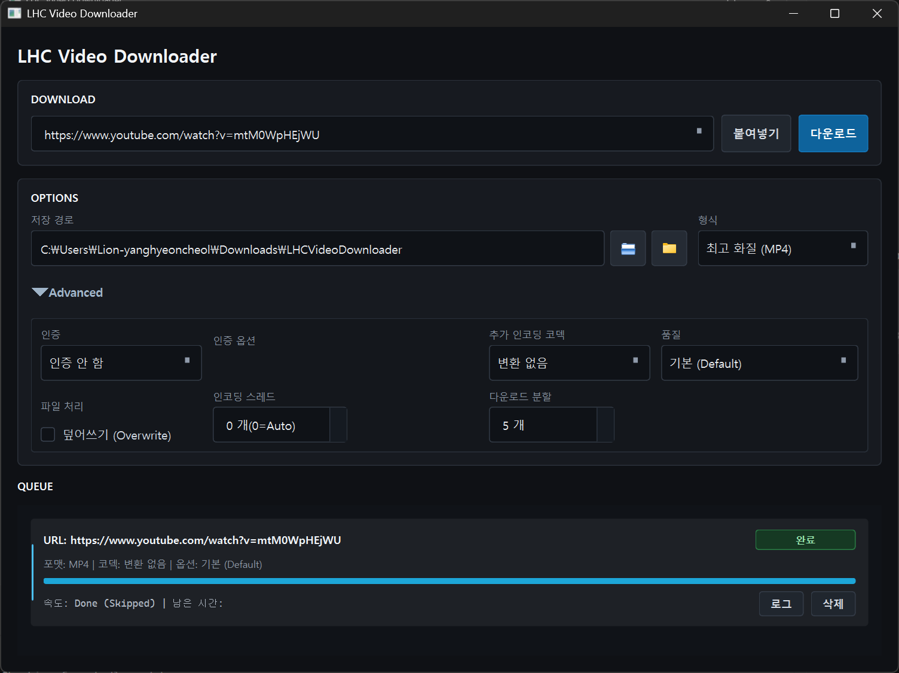

#  LHC Video Downloader

**LHC Video Downloader**는 YouTube, Vimeo, Twitch 등 1000개 이상의 사이트를 지원하는 강력하고 직관적인 데스크탑용 비디오 다운로더입니다. 최신 `yt-dlp` 엔진을 기반으로 하며, 사용자 친화적인 GUI와 강력한 성능 최적화 기능을 제공합니다.



## ✨ 주요 기능 (Key Features)

*   **광전송급 다운로드 속도**: `yt-dlp`의 강력한 성능과 멀티 스레드/분할 다운로드 지원.
*   **스마트 포맷 선택**:
    *   **MP4**: 4K/8K 초고화질 우선 (VP9/AV1) 또는 1080p 호환성 모드(H.264) 자동 전환.
    *   **WebM**: 구글 표준 고화질 자동 선택.
    *   **변환 없음**: 인코딩 없이 원본을 그대로 가져와 즉시 저장 (초고속).
*   **강력한 포스트 프로세싱**:
    *   **GPU 가속**: NVENC (NVIDIA GPU) 하드웨어 인코딩 지원.
    *   **다양한 프리셋**: 무손실, 고화질, 최대 압축 등 용도별 설정.
*   **고급 기능**:
    *   **앱 내 로그인**: YouTube 연령 제한 동영상 다운로드 지원 (QtWebEngine 기반).
    *   **중복 처리**: 이미 받은 파일 건너뛰기 또는 덮어쓰기 옵션.
    *   **안전한 취소**: 다운로드 중 취소 시 임시 파일 자동 클린업.

---

## 📥 설치 및 실행 (Installation)

GitHub Releases 페이지에서 최신 버전을 다운로드할 수 있습니다.

1.  **[Releases 페이지](https://github.com/CharlieYang0040/lhcVideoDownloader/releases)**로 이동합니다.
2.  최신 버전의 `LHCVideoDownloader_vX.X.zip` 파일을 다운로드합니다.
3.  다운로드한 압축 파일의 압축을 풉니다.
4.  폴더 내의 **`LHCVideoDownloader.exe`** 를 더블 클릭하여 실행합니다.
    *   별도의 설치 과정이 필요 없습니다 (Portable).

---

## 📖 사용법 (Usage Guide)

앱은 크게 세 부분으로 구성되어 있습니다.

### 1. 다운로드 추가 (Add New Download)
*   **URL 입력**: 상단 입력창에 유튜브 등의 링크를 붙여넣으세요.
*   **붙여넣기**: 클립보드에 있는 주소를 자동으로 가져옵니다.
*   **다운로드 시작**: 설정을 확인한 후 버튼을 누르면 목록에 추가되고 바로 시작됩니다.

### 2. 설정 옵션 (Options)

#### 기본 설정 (Basic)
*   **저장 경로**: 파일이 저장될 위치를 지정합니다. 우측 폴더 열기 아이콘을 통해 저장된 폴더를 바로 열 수 있습니다.
*   **형식 (Format)**:
    *   `최고 화질 (MP4/MKV/WebM)`: 영상 화질과 호환성이 가장 좋은 설정으로 다운로드합니다 (4K/8K 지원).
    *   `오디오만 (MP3/WAV)`: 영상에서 오디오만 추출하여 소리 파일로 변환합니다.
*   **인증 (Auth)**: 연령 제한 영상이나 멤버십 영상을 다운로드할 때 사용하는 인증 방식입니다.
    *   `앱 내 로그인 (권장)`: 앱 내부에서 안전하게 구글 로그인을 진행합니다.
    *   `Firefox`: 현재 설치된 Firefox 브라우저의 세션(쿠키)을 자동으로 가져옵니다.
    *   `파일 (Cookies.txt)`: 사용자가 직접 추출한 쿠키 파일을 지정하여 사용합니다.
    *   `인증 안 함`: 일반적인 공개 영상 다운로드 시 사용합니다 (기본값).

#### 고급 옵션 (Advanced)
*   **추가 인코딩 코덱**: 다운로드 후 변환할 코덱을 지정합니다 (`변환 없음` 추천).
    *   `H264 (CPU)`, `NVENC H264 (GPU)`, `HEVC (H265)`, `VP9` 등 하드웨어 가속(GPU) 지원 코덱을 선택할 수 있습니다.
*   **품질 (Preset)**: 선택한 코덱에 적용할 화질/압축 프리셋입니다. (`기본 (Default)`, `무손실 (Lossless)`, `최소 손실 (High Quality)`, `최대 압축 (Small Size)`)
*   **파일 처리 (Overwrite)**: `덮어쓰기` 체크 시 같은 이름의 파일이 이미 존재하면 덮어씁니다. 해제 시 건너뜁니다.
*   **인코딩 스레드**: 인코딩 시 사용할 CPU 스레드 개수를 설정합니다. (`0` = 자동 설정으로 시스템 최대 성능 사용)
*   **다운로드 분할**: 다운로드 시 파일을 여러 조각으로 나누어 동시에 받아 다운로드 속도를 극대화합니다 (기본값 `5`).

### 3. 작업 목록 (Task List)
*   진행 중인 다운로드의 상태(속도, 남은 시간, 퍼센트)를 실시간으로 보여줍니다.
*   **Logs**: 각 작업의 `로그` 버튼을 누르면 `yt-dlp`의 상세한 진행 상황을 볼 수 있습니다.
*   **Cancel**: 작업을 취소하고 찌꺼기 파일을 정리합니다.

---

## 🛠️ 개발자용 설정 (Development Setup)

소스 코드를 직접 실행하거나 빌드하려면 `libs` 폴더에 다음 바이너리 파일들이 필요합니다.

### 필수 바이너리 다운로드 (Libs)
앱 실행을 위해 루트 디렉토리의 `libs` 폴더 아래에 다음 구조로 파일들을 배치해야 합니다.

1.  **FFmpeg** (영상 변환 및 병합, 필수)
    *   다운로드: [gyan.dev (Windows Builds)](https://www.gyan.dev/ffmpeg/builds/)
    *   `ffmpeg-git-full.7z` 다운로드 -> 압축 해제 -> `bin` 폴더 안의 `ffmpeg.exe`, `ffprobe.exe`
    *   위치: `libs/ffmpeg/ffmpeg.exe`, `libs/ffmpeg/ffprobe.exe`

2.  **yt-dlp** (다운로드 코어 엔진, 필수)
    *   다운로드: [yt-dlp GitHub Releases](https://github.com/yt-dlp/yt-dlp/releases)
    *   `yt-dlp.exe` 다운로드
    *   위치: `libs/yt-dlp/yt-dlp.exe`

3.  **Deno** (일부 사이트 자바스크립트 처리용, 권장)
    *   다운로드: [Deno GitHub Releases](https://github.com/denoland/deno/releases)
    *   `deno-x86_64-pc-windows-msvc.zip` 다운로드 -> `deno.exe`
    *   위치: `libs/deno/deno.exe`

### 폴더 구조 예시
```text
lhcVideoDownloader/
├── libs/
│   ├── ffmpeg/
│   │   ├── ffmpeg.exe
│   │   └── ffprobe.exe
│   ├── yt-dlp/
│   │   └── yt-dlp.exe
│   └── deno/
│       └── deno.exe
├── src/
└── main.py
```

## ⚖️ 라이선스 및 주의사항
이 프로그램은 오픈 소스 프로젝트입니다. 다운로드한 콘텐츠의 저작권과 관련된 책임은 전적으로 사용자에게 있습니다. 개인적인 용도로만 사용하시기 바랍니다.
