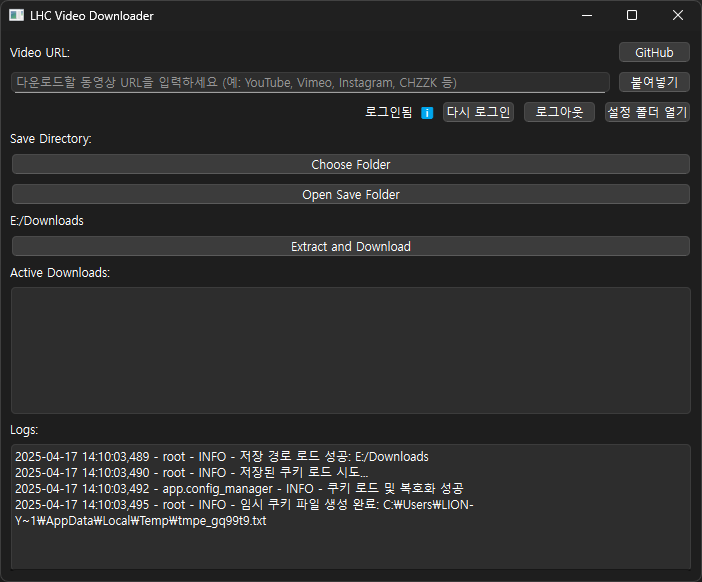

# LHC 비디오 다운로더 (LHC Video Downloader)

아티스트의 레퍼런스 수집을 돕기 위해 1000개 이상 사이트에서 최고 품질 비디오를 손쉽게 다운로드하고 MP4로 변환하는 애플리케이션입니다.




## 빠른 시작 (가장 쉬운 실행 방법)

**방법 1: 릴리즈 실행 파일 사용 (Windows)**

1.  이 **[다운로드 링크](<https://github.com/CharlieYang0040/lhcVideoDownloader/releases/download/v1.0.1/videoDownloaderApp.exe>)** 로 즉시 다운로드 합니다.
2.  또는 GitHub 저장소의 Release 페이지로 이동하여 최신 릴리즈의 Assets 섹션에서 `.exe` 파일을 다운로드합니다.
3.  다운로드한 `.exe` 파일을 직접 실행합니다. (Python 또는 라이브러리 설치 필요 없음)


**방법 2: 배치 파일 실행 (Windows)**

1.  이 저장소의 파일들을 다운로드하거나 `git clone` 받습니다.
2.  다운로드한 폴더에서 `launch_VideoDownloader.bat` 파일을 더블 클릭하여 실행합니다.
3.  스크립트가 자동으로 Python 설치 여부를 확인하고, 가상 환경을 설정하며, 필요한 라이브러리(**및 FFmpeg**)를 **확인하고 설치**합니다. (FFmpeg 다운로드 및 압축 해제에는 시간이 걸릴 수 있습니다.)
4.  설치가 완료되면 애플리케이션이 자동으로 실행됩니다.


---

## 주요 기능

*   **다양한 사이트 비디오 다운로드:** URL을 입력하여 지원하는 여러 웹사이트의 비디오를 다운로드합니다. 내부적으로 `yt-dlp`를 사용하므로, `yt-dlp`가 지원하는 대부분의 사이트([지원 사이트 목록](https://github.com/yt-dlp/yt-dlp/blob/master/supportedsites.md) 참고)에서 작동합니다. (예: YouTube, Vimeo, Instagram, Facebook, Twitter, Naver TV, CHZZK 등)
*   **자동 포맷 선택 및 변환:** `yt-dlp`를 사용하여 최적의 비디오/오디오 포맷을 자동으로 선택하고, `ffmpeg`을 사용하여 MP4 컨테이너로 병합 및 인코딩합니다.
*   **YouTube 로그인 지원:** YouTube의 연령 제한 또는 회원 전용 콘텐츠 등 로그인이 필요한 비디오를 다운로드하기 위해 GUI 내 웹뷰를 통해 Google 계정 로그인을 지원합니다. (로그인 정보는 암호화되어 로컬에 저장됩니다.)
*   **동시 다운로드:** 여러 비디오 다운로드를 동시에 진행하고 목록에서 상태를 확인할 수 있습니다.
*   **작업 취소:** 진행 중인 다운로드 작업을 목록에서 우클릭하여 취소할 수 있습니다.
*   **저장 경로 관리:** 다운로드 저장 경로를 지정하고 마지막 경로를 기억합니다.
*   **로그 관리:** 애플리케이션 로그를 파일(`logs/app.log`)로 저장합니다.

## 요구 사항 (직접 실행 시)

*   **Python:** 3.8 이상 권장
*   **PySide6:** Qt for Python 라이브러리 (`pip install PySide6`)
*   **yt-dlp:** 비디오 다운로드 엔진 (`pip install yt-dlp`)
*   **cryptography:** 쿠키 암호화/복호화 (`pip install cryptography`)
*   **FFmpeg:** 비디오/오디오 병합 및 인코딩. 애플리케이션 실행 파일 또는 스크립트와 같은 디렉토리 내의 `libs/ffmpeg-7.1-full_build/bin` 폴더 안에 `ffmpeg.exe` 파일이 위치해야 합니다. (다른 버전의 FFmpeg를 사용할 경우 경로 수정 필요)

## 설치 및 실행 (수동 설정)

1.  **저장소 복제:**
    ```bash
    git clone https://github.com/CharlieYang0040/lhcVideoDownloader.git
    cd LHCVideoDownloader
    ```
2.  **가상 환경 생성 (권장):**
    ```bash
    python -m venv venv
    # Windows
    .\venv\Scripts\activate
    # macOS/Linux
    source venv/bin/activate
    ```
3.  **필수 라이브러리 설치:**
    ```bash
    pip install PySide6 yt-dlp cryptography
    ```
4.  **FFmpeg 준비:**
    *   FFmpeg 바이너리([공식 사이트](https://ffmpeg.org/download.html) 또는 [gyan.dev](https://www.gyan.dev/ffmpeg/builds/) 등에서 다운로드)를 프로젝트 루트 디렉토리 아래에 `libs/ffmpeg-7.1-full_build/bin/` 경로를 생성하고 그 안에 `ffmpeg.exe` (및 필요한 다른 파일들)을 복사합니다.
    *   예시 경로: `LHCVideoDownloader/libs/ffmpeg-7.1-full_build/bin/ffmpeg.exe`
5.  **애플리케이션 실행:**
    ```bash
    python videoDownloaderApp.py
    ```

## 사용 방법

1.  애플리케이션을 실행합니다.
2.  다운로드할 비디오 URL(예: YouTube, Vimeo, Instagram, CHZZK, Naver TV 등)을 입력하거나 클립보드에서 붙여넣습니다.
3.  **"Choose Folder"** 버튼을 클릭하여 비디오를 저장할 디렉토리를 선택합니다. (선택하지 않으면 기본 경로 사용)
4.  **"Extract and Download"** 버튼을 클릭하여 다운로드를 시작합니다.
5.  다운로드 진행 상황은 **"Active Downloads"** 목록과 **"Logs"** 창에서 확인할 수 있습니다.
6.  **로그인 필요 콘텐츠 (예: 연령 제한):**
    *   로그인이 필요한 경우, **"사이트 로그인"** 버튼을 클릭하고 팝업 창에서 해당 사이트의 계정으로 로그인합니다.
    *   (참고: 현재 로그인 기능은 주로 YouTube의 Google 로그인을 위해 구현되었습니다.)
    *   로그인이 완료되면 "로그인됨" 상태로 변경되며, 해당 계정으로 접근 가능한 비디오를 다운로드할 수 있습니다.
    *   로그아웃하려면 **"로그아웃"** 버튼을 클릭합니다.
7.  **작업 취소:** "Active Downloads" 목록에서 취소하려는 항목을 우클릭하고 "Cancel Task"를 선택합니다.

## 설정 및 데이터 폴더

애플리케이션은 다음 폴더와 파일을 사용자의 로컬 AppData 디렉토리(`%LOCALAPPDATA%\LHCVideoDownloader`) 아래에 생성합니다.

*   `config/`: 애플리케이션 설정 파일 (`app_settings.json` - 저장 경로 등), 암호화 키 파일 (`encryption.key`) 저장
*   `cookies/`: 암호화된 세션 쿠키 파일 (`session.cookies`) 저장
*   `logs/` (애플리케이션 실행 위치 기준): 애플리케이션 실행 로그 파일 (`app.log`) 저장

## 빌드 (선택 사항)

[PyInstaller](https://pyinstaller.readthedocs.io/en/stable/)를 사용하여 실행 파일(.exe)을 만들 수 있습니다. 이 저장소에는 이미 필요한 설정 (`videoDownloaderApp.spec`)이 포함되어 있으므로, 이 파일을 사용하는 것이 가장 좋습니다.

1.  **PyInstaller 설치:** (가상환경 내 권장)
    ```bash
    pip install pyinstaller
    ```
2.  **빌드 실행:** 프로젝트 루트 디렉토리에서 다음 명령을 실행합니다.
    ```bash
    pyinstaller videoDownloaderApp.spec
    ```

*   이 `.spec` 파일은 FFmpeg 바이너리(`libs/ffmpeg/bin/ffmpeg.exe`), 아이콘 파일(`resources/icon.ico`), 그리고 웹 엔진 및 암호화 관련 숨겨진 의존성을 자동으로 포함하도록 설정되어 있습니다.
*   또한, 빌드 크기를 줄이기 위해 사용되지 않는 일부 모듈을 제외하고 UPX로 실행 파일을 압축합니다 (`upx=True`).
*   **참고:** 현재 `.spec` 파일은 콘솔 창이 함께 뜨는 실행 파일(`console=True`)을 생성합니다. 만약 콘솔 창 없이 GUI만 표시되는 실행 파일을 원한다면, `videoDownloaderApp.spec` 파일을 열어 `exe = EXE(...)` 섹션 안의 `console=True` 를 `console=False` 로 직접 수정한 후 빌드하십시오.
*   빌드 결과는 `dist` 폴더 안에 `videoDownloaderApp` 폴더 형태로 생성됩니다.


## 라이선스

이 프로젝트 자체는 MIT 라이선스 하에 배포됩니다. 자세한 내용은 `LICENSE` 파일을 참고하십시오.

이 애플리케이션은 다음과 같은 주요 오픈소스 라이브러리들을 사용하며, 각 라이브러리는 자체 라이선스를 따릅니다:

*   **PySide6:** [LGPLv3](https://www.gnu.org/licenses/lgpl-3.0.html)
*   **yt-dlp:** [Unlicense](https://unlicense.org/)
*   **cryptography:** [Apache License 2.0](https://www.apache.org/licenses/LICENSE-2.0) 및 [BSD License](https://www.openssl.org/source/license.html)
*   **FFmpeg:** 포함된 빌드에 따라 [LGPL](https://www.gnu.org/licenses/lgpl-2.1.html) 또는 [GPL](https://www.gnu.org/licenses/gpl-3.0.html). (자세한 내용은 FFmpeg 공식 문서를 확인하십시오.)

애플리케이션을 사용하거나 배포할 때는 이 프로젝트의 라이선스와 사용된 라이브러리들의 라이선스 규정을 모두 준수해야 합니다.
